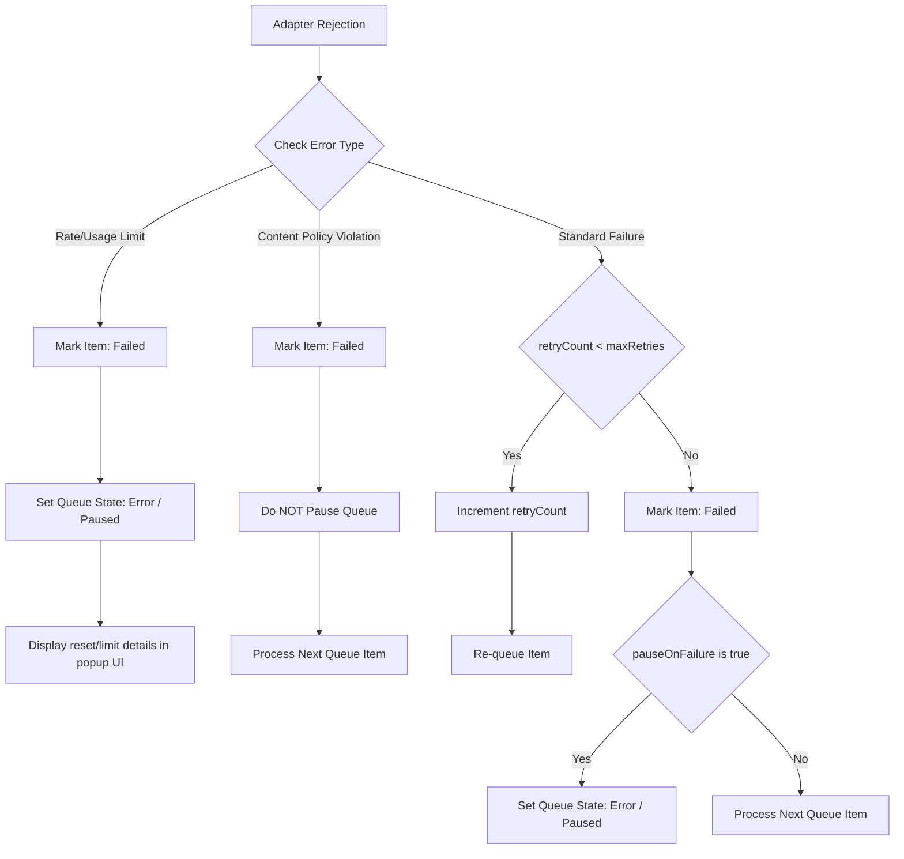

# Technical Documentation - Advanced Queue Processing & Robust DOM Handlers

This document details the architectural updates implemented to ensure robust, unattended image generation processing in background tabs, proactive rate/usage limit handling, content policy bypassing, and brand logo integration.

---

## 1. Background Tab Throttling & Lazy-Load Mitigation

### The Problem
When the user switches tabs, modern browser engines throttle JavaScript execution, rendering cycles, and viewport visibility checkers. This introduces two failure points:
1. **Lazy-loading stoppage**: ChatGPT and Gemini pause mounting high-resolution image resources into `.src` when elements are not in the active viewport. The source remains empty or a tiny spacer placeholder (e.g. transparent 1x1 base64 GIF).
2. **Hidden upload targets**: Gemini hosts its file upload inputs inside shadow roots (`#shadow-root`) encapsulated within Lit or Angular custom web components (such as `<uploader>` or `<rich-textarea>`). Standard `document.querySelector` operations cannot pierce shadow boundaries.

### The Solution

#### A. Multi-Attribute & Srcset Extraction
The image extractors in both `src/content/chatgpt-adapter.ts` and `src/content/gemini-adapter.ts` inspect secondary attributes to bypass lazy-loading throttling:
* **Attribute fallbacks**: Scans `img.src`, `data-src`, `srcset`, `data-original-src`, and `data-image-src`.
* **Srcset Parsing**: The `parseSrcset()` helper parses `srcset` strings, extracts individual URL descriptors, and returns the highest resolution variant:
  ```typescript
  function parseSrcset(srcset: string): string {
    if (!srcset) return '';
    if (!srcset.includes(' ')) return srcset.trim();
    const parts = srcset.split(',');
    const lastPart = parts[parts.length - 1].trim();
    const urlAndWidth = lastPart.split(/\s+/);
    return urlAndWidth[0].trim();
  }
  ```

#### B. Deep Shadow DOM Traversal
For multimodal reference image uploads, the content script utilizes a recursive shadow root search helper starting from the text composer to find hidden input controls:
```typescript
function findFileInput(root: Document | Element | ShadowRoot): HTMLInputElement | null {
  try {
    const input = root.querySelector('input[type="file"]') || root.querySelector('input[accept*="image"]');
    if (input instanceof HTMLInputElement) return input;

    // Traverse all children's shadow roots
    const children = root.querySelectorAll('*');
    for (const child of children) {
      if (child.shadowRoot) {
        const found = findFileInput(child.shadowRoot);
        if (found) return found;
      }
    }
  } catch {
    // Ignore invalid contexts
  }
  return null;
}
```
* **Event Dispatch Sync**: Re-enforces state sync across custom element boundaries by dispatching bubbled, composed change and input events:
  ```typescript
  fileInput.dispatchEvent(new Event('change', { bubbles: true, composed: true }));
  fileInput.dispatchEvent(new Event('input', { bubbles: true, composed: true }));
  ```

---

## 2. Proactive Rate & Usage Limit Interception

### The Problem
When ChatGPT or Gemini usage quotas are exceeded, the prompt textcomposer element becomes disabled or blocked by overlay banners (e.g., *"Chat paused until usage resets at 2:52 PM"*). 
Previously, the extension would wait for a 15-second initialization timeout, fail, and immediately retry. This created an infinite loop (Retry 1, 2, 3) that spammed the chat interface with duplicate prompt entries while leaving the user in the dark.

### The Solution

#### A. DOM Limit Scanners
Added `getLimitError()` to `chatgpt-detector.ts` and `gemini-detector.ts` to actively scan the page for rate or quota-related strings:
* **ChatGPT patterns**: `"Chat paused until usage resets"`, `"reached the limit"`, `"too many requests"`, `"rate limit"`, `"limit for chats"`, `"upgrade to Plus"`, `"upgrade to continue"`.
* **Gemini patterns**: `"reached your image generation limit"`, `"usage limit reached"`, `"quota exceeded"`, `"resource exhausted"`, `"try again later"`, `"Gemini Advanced required"`.
* **Safety boundaries**: Limits matching to shallow DOM segments (elements with fewer than 6 children and text lengths under 300 characters) to avoid capturing large main layouts.

#### B. Direct Adapter Aborts
Both the ChatGPT and Gemini adapters monitor `getLimitError()` during page preparation (`waitForReady`) and output rendering (`waitForImage`). If a limit error is caught, the adapter aborts the operation instantly and rejects the promise with a structured error prefix: `"Usage Limit Reached: [Message Text]"`.

---

## 3. Queue Manager Error State Machine

The background queue manager (`src/queue/queue-manager.ts`) classifies errors in its failure handler to dictate state machine transitions:



### Flow Definitions:
1. **Rate / Usage Limit Transition (`isRateLimit`)**:
   * Intercepted via matches on `limit`, `quota`, `rate limit`, `paused until`, `too many requests`, or `resource exhausted`.
   * **Action**: Sets `item.status = 'failed'`, records the message in `item.error`, and transitions the entire queue state to `'error'` (paused). 
   * **Result**: Halts further generations automatically. The user is presented with the exact reset time directly in the popup, avoiding unnecessary prompt retries.
2. **Content Policy Block Transition (`isContentPolicy`)**:
   * Intercepted via matches on `content policy`, `violate`, `policy violation`, `against our policy`, `can't generate`, or `cannot generate`.
   * **Action**: Sets `item.status = 'failed'` and sets `item.error = 'Content Policy Blocked: [Message Text]'`. It does **NOT** increment `retryCount` and does **NOT** transition the queue state.
   * **Result**: **Bypasses and skips** the failed item. The queue manager proceeds straight to the next prompt, allowing non-violating prompts to build without locking up the queue.
3. **Standard Failure Transition**:
   * Increment retry counters. If retry bounds are exceeded, fail the item and optionally pause the queue if `pauseOnFailure` is toggled.

---

## 4. Visual Layout Brand Identity

To transition the extension from basic placeholders, we updated the visual design assets:
* **Vector Icon**: An overlapping stack of three cards representing a photo queue. The topmost card uses a high-contrast gradient background (neon purple to emerald green) overlayed with white landscape glyph lines.
* **Inline SVG replica**: Rendered within the header of `src/popup/popup.html` to guarantee lightweight, crisp scaling:
  ```html
  <svg width="24" height="24" viewBox="0 0 24 24" fill="none" xmlns="http://www.w3.org/2000/svg">
    <rect x="7" y="7" width="13" height="13" rx="2" fill="none" stroke="#8b5cf6" stroke-width="1.5" opacity="0.4"/>
    <rect x="5" y="5" width="13" height="13" rx="2" fill="none" stroke="#6366f1" stroke-width="1.5" opacity="0.7"/>
    <rect x="2" y="2" width="14" height="14" rx="3" fill="url(#logo-grad)"/>
    <circle cx="11.5" cy="5.5" r="1.2" fill="white"/>
    <path d="M4 12l2.5-2.5 3 3 1.5-1.5 2 2" stroke="white" stroke-width="1" stroke-linecap="round" stroke-linejoin="round"/>
    <defs>
      <linearGradient id="logo-grad" x1="2" y1="2" x2="16" y2="16" gradientUnits="userSpaceOnUse">
        <stop offset="0%" stop-color="#8b5cf6"/>
        <stop offset="100%" stop-color="#10b981"/>
      </linearGradient>
    </defs>
  </svg>
  ```
* **System-level Assets**: Resized into standard dimensions (`16x16`, `48x48`, and `128x128`) inside the `/icons` folder to represent the extension in the Chrome Toolbar and Extensions management tab.
